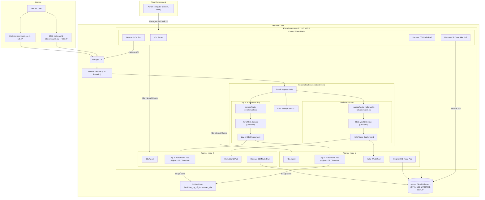

```mermaid
graph TD
    subgraph Your Environment
        Laptop["Admin computer (kubectl, helm)"]
    end

    subgraph Internet
        User["Internet User"]
        DNS_Hello["DNS: hello-world-k3s.erkinjuntti.eu --> LB_IP"]
        DNS_Joy["DNS: joy.erkinjuntti.eu --> LB_IP"]
    end

    subgraph Hetzner Cloud
        Firewall["Hetzner Firewall (k3s-firewall-1)"]
        LB["Hetzner Load Balancer (95.217.170.60)"]
        GitHubRepo["GitHub Repo: TatuE/the_joy_of_Kubernetes_site"]
        HetznerCloudVolumes[(Hetzner Cloud Volumes - NOT IN USE WITH THIS SETUP)]

        subgraph K3s Cluster on Private Network ["k3s-private-network: 10.0.0.0/16"]
            CP["k3s-control-plane-1 (10.0.0.2)"]
            W1["k3s-worker-1 (10.0.0.3)"]
            W2["k3s-worker-2 (10.0.0.4)"]

            subgraph CP ["Control Plane Node"]
                K3sServer["K3s Server"]
                CCMPod["Hetzner CCM Pod"]
                CSICtrlPod["Hetzner CSI Controller Pod"]
                CSINodePodCP["Hetzner CSI Node Pod"]
            end

            subgraph W1 ["Worker Node 1"]
                K3sAgent1["K3s Agent"]
                CSINodePodW1["Hetzner CSI Node Pod"]
                HelloPod1["Hello World Pod"]
                JoyPod1["Joy of Kubernetes Pod (Nginx + Git Clone Init)"]
            end

            subgraph W2 ["Worker Node 2"]
                K3sAgent2["K3s Agent"]
                CSINodePodW2["Hetzner CSI Node Pod"]
                HelloPod2["Hello World Pod"]
                JoyPod2["Joy of Kubernetes Pod (Nginx + Git Clone Init)"]
            end

            subgraph KSC ["Kubernetes Services/Controllers"]
                TraefikPods["Traefik Ingress Pods"]
                LetsEncrypt["Let's Encrypt for SSL"]

                subgraph HWA ["Hello World App"]
                    HelloIngressRoute["IngressRoute: hello-world-k3s.erkinjuntti.eu"]
                    HelloService["Hello World Service (ClusterIP)"]
                    HelloDeployment["Hello World Deployment"]
                end

                subgraph JKA ["Joy of Kubernetes App"]
                    JoyIngressRoute["IngressRoute: joy.erkinjuntti.eu"]
                    JoyService["Joy of K8s Service (ClusterIP)"]
                    JoyDeployment["Joy of K8s Deployment"]
                end
            end
        end
    end

    %% Connections
    Laptop --> |Manages via Public IP| CP(K3s API on 157.180.74.180:6443)
    User --> DNS_Hello
    User --> DNS_Joy
    DNS_Hello --> LB
    DNS_Joy --> LB
    LB --> Firewall
    Firewall --> TraefikPods

    TraefikPods --> LetsEncrypt
    TraefikPods --> HelloIngressRoute
    HelloIngressRoute --> HelloService
    HelloService --> HelloDeployment
    HelloDeployment --> HelloPod1
    HelloDeployment --> HelloPod2

    TraefikPods --> JoyIngressRoute
    JoyIngressRoute --> JoyService
    JoyService --> JoyDeployment
    JoyDeployment --> JoyPod1
    JoyDeployment --> JoyPod2
    JoyPod1 --> |Init: git clone| GitHubRepo
    JoyPod2 --> |Init: git clone| GitHubRepo

    CP --> |K3s Internal Comm| W1
    CP --> |K3s Internal Comm| W2

    CCMPod --> |Hetzner API| LB(Manages LB)
    CSICtrlPod --> |Hetzner API| HetznerCloudVolumes
    CSINodePodCP --> HetznerCloudVolumes
    CSINodePodW1 --> HetznerCloudVolumes
    CSINodePodW2 --> HetznerCloudVolumes
```