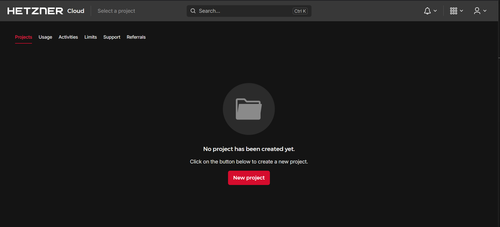
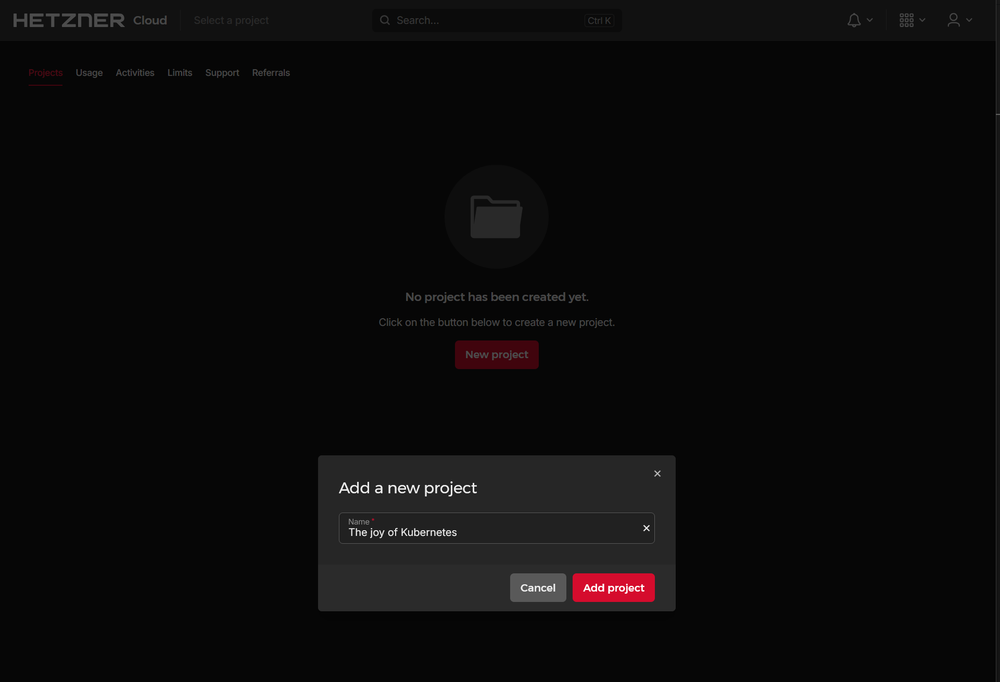
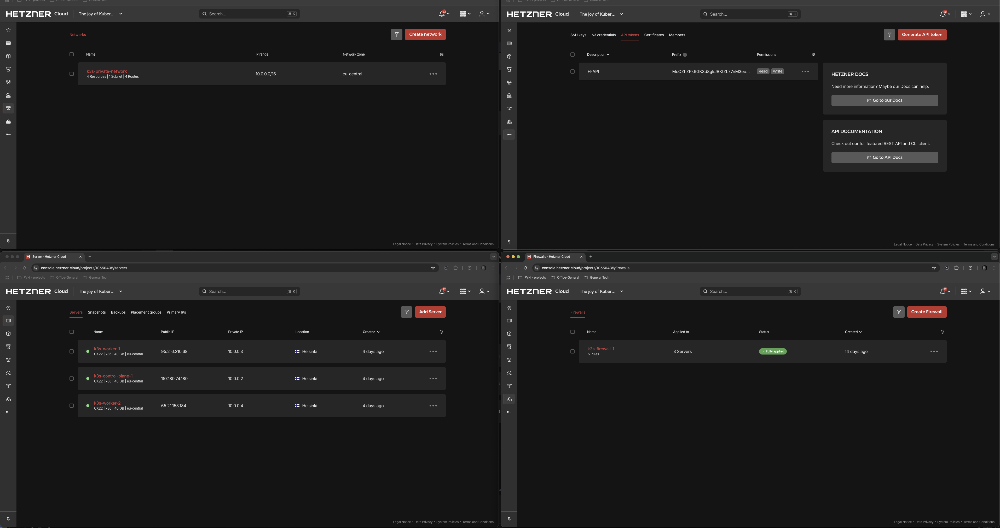

# Setting up Hetzner Cloud

## *Prerequisites*

1. **Hetzner Cloud Account:** You need an active account 
2. **Local Tools:** `kubectl` (the Kubernetes command-line tool) and helm (package manager for Kubernetes) installed on your local machine.

## 1. Creating a new project

We started off by creating a new could project. I Hetzner this is quite straightforward.

### 1.1 Enable connectivity

1. **SSH Key** 
    * Add the needed public SSH keys to the Hetzner project (Security \-\> SSH Keys). 
2. **API Token** 
    * Generate an API token within the Hetzner Cloud project (Security \-\> API Tokens). Grant it **Read & Write** permissions. Store this token securely.  

## 2. Setting up infrastructure for the new project

**Use Hetzner Cloud Console in the project**  

1. **Create 3 Cloud Servers (1 control-plane, 2 workers)**
    * **Location:** Helsinki (hel1)  
    * **ISO Image:** Ubuntu 24.04  
    * **Type:** CX22 (Intel, 2 vCPU:s, 4 GB RAM, 40 GB SSD, 20 TB Traffic)  
    * **SSH Key:** Public key from project members computer  
    * **Naming:** k8s-control-plane-1, k8s-worker-1, k8s-worker-2
2. **Create Private Network:**
  * **Name:** k8s-private-network
  * **IP range:** 10.0.0.0/16
  * Attach all 3 servers.
    * **Note**, the servers have now an IP on a public and a private network, on two different interfaces.
3. **Create Firewall:** 
  * **Name:** k8s-firewall-1
  * **Inbound Rules:** 
    * Allow:
      * SSH (TCP/22 from your All IPV4 (Restrict to my IP in the future)) 
      * K8s API (TCP/6443 from your All IPV4 (Restrict to my IP in the future)) 
      * NodePorts (TCP/30000-32767 from All IPV4)
      * K3s internal ports (UDP/8472, TCP/10250 from private network IPs)
      * ICMP (from private network IPs).  
    * **Outbound Rules:** 
      * Allow all.  
    * Apply to all 3 servers.

## 3 Start Kubernetes deployment

Now that we have are infrastructure setup, we can start installing Kubernetes and deploying the cluster.

before we did anything, we updated the virtual machines.
* use ssh to connect to the machines
* Note, since this is a bare machine, the only user accessible is ``root``.  
* Update packages ``apt-get update``
* Upgrade packages ``apt-get upgrade``

Once this was done, we could begin the K3S installation.

### 3.1.1 Install Kubernetes control plane

Install K3s in the k8s-control-plane-1 machine.
In this case we use the [install_K3s_server](scripts/K3s/install_K3s_server.sh) script.
The easiest way was just to copy ``scp`` the shell script from the local machine to the virtual machine and make it and executable ``chmod -x``. 
Once this is done, we just executed (``./install_K3s_server.sh``)the script and check the installation was performed without error.

### 3.1.2 Get the K3s token

Once the installation is done, we need the k3s token from the control-plane for the worker node installation.  
``cat /var/lib/rancher/k3s/server/node-token``
We copied this to be used in the worker node installation.

## 3.2 Install Kubernetes Worker nodes

Install K3s in the worker-node machines (k8s-worker-1 & k8s-worker-2).
We are using the same script base as with the K3s server installation but with a few modifications, primarily we define the control-plane IP-address and K3S token. All of this is explained in the [agent installation script](Scripts/K3s/install_K3s_worker.sh).
Like with the previous installation, the easiest way was just to copy ``scp`` the shell script from the local machine to the virtual machine and make it and executable ``chmod -x``.
Once this is done, we just executed (``./install_K3s_worker.sh``)the script and check the installation was performed without error.

## 3.3 Get the Kubernetes configuration for local management

Once the worker nodes are installed, we need to get the control-plane configuration, so we can manage to kubernetes network from a local computer (in our case using ``kubectl``).

we copied the ks3.yaml configuration file (located at ``/etc/rancher/k3s/k3s.yaml``) from the k8s-control-plane-1 machine to our local computer. In the file, we edit the ``server``address (which is local host (127.0.0.1) by default) with the IP of the  k8s-control-plane-1 machine. 

once done, we refer this .yaml file as the Kubernetes configuration for ``kubectl``. 
After this, we can check if we can connect to the Kubernetes cluster.

## 3.4 Integrate Hetzner cloud features

No that we have confirmed that our cluster base is up a running, let's integrate Hetzner cloud features that we can utilize Cloud Controller Manager (CCM) and Container Storage Interface (CSI).

### Cloud Controller Manager (CCM)

The Cloud Controller Manager (CCM) is a key component in Kubernetes that acts as a bridge between your Kubernetes cluster and the specific APIs of your cloud provider (like AWS, Azure, or Google Cloud).

Here's a short explanation of its purpose and function:

* Decouples Kubernetes from Cloud Providers: The CCM allows Kubernetes to remain cloud-agnostic. It separates cloud-specific logic from the core Kubernetes components. This means you can run Kubernetes on different cloud platforms without needing to change the core Kubernetes code.
* Manages Cloud-Specific Resources: It handles tasks that require interaction with the cloud provider's services. This includes:
  * Nodes: Managing Kubernetes nodes, such as updating them with cloud-specific information (like region or instance type) and checking their health with the cloud provider.
  * Routes: Configuring network routes in the cloud so that containers on different nodes within your cluster can communicate with each other.
  * Services (Load Balancers): Integrating Kubernetes services with cloud provider load balancers. When you create a Kubernetes Service of type LoadBalancer, the CCM interacts with the cloud provider's API to provision and configure the necessary load balancer.
  * Storage: Assisting in provisioning persistent storage volumes that are backed by cloud storage solutions.
* Enables Cloud Provider Innovation: By having a separate CCM, cloud providers can develop and release new features and integrations with Kubernetes at their own pace, without being tied to the Kubernetes release cycle.

In essence, the Cloud Controller Manager allows your Kubernetes cluster to leverage the specific capabilities of your chosen cloud provider in a standardized and abstracted way. Each cloud provider typically has its own implementation of the CCM.

### Container Storage Interface (CSI)

The Container Storage Interface (CSI) is a standard API that enables storage vendors to develop plugins that allow their storage systems to work seamlessly with container orchestrators like Kubernetes.

Here's a breakdown of its significance:

* Standardization: CSI provides a common interface, meaning storage providers don't have to write custom code for every different container orchestrator. They can write one CSI driver, and it should work with any orchestrator that supports CSI.
* Extensibility for Kubernetes (and other orchestrators): Before CSI, adding support for new storage systems to Kubernetes (known as "in-tree" plugins) meant that the storage driver's code had to be part of the core Kubernetes codebase. This made it slow to add new drivers and tied storage releases to Kubernetes releases. CSI allows "out-of-tree" plugins, meaning storage vendors can develop, deploy, and update their drivers independently of Kubernetes.
* More Storage Options: Because it's easier for vendors to create CSI drivers, Kubernetes users have a wider variety of storage options available to them, whether it's cloud-based storage, on-premises network-attached storage (NAS), storage area networks (SANs), or newer distributed storage solutions.
* Dynamic Provisioning and Management: CSI drivers typically handle:
  * Dynamic volume provisioning: Automatically creating storage volumes when requested by a container.
  * Attaching/Detaching volumes: Connecting and disconnecting storage volumes from the nodes (servers) where containers are running.
  * Mounting/Unmounting volumes: Making the storage accessible within the containers.
  * Snapshots and Resizing: Many CSI drivers also support creating snapshots of volumes and resizing them.

In short, CSI simplifies how containerized applications access and use persistent storage by creating a universal "plug-and-play" model for storage in containerized environments

This can be done in four (4) steps. You can do it in only three (3), but in my opinion the fourth step is the most important.

  1. Create a secret that stores the Hetzner API key
  2. Install Hetzner CCM
  3. Install CSI
  4. Confirm installation

## 3.4.1 Create a secret that stores the Hetzner API key

We used the API token we generated earlier. 