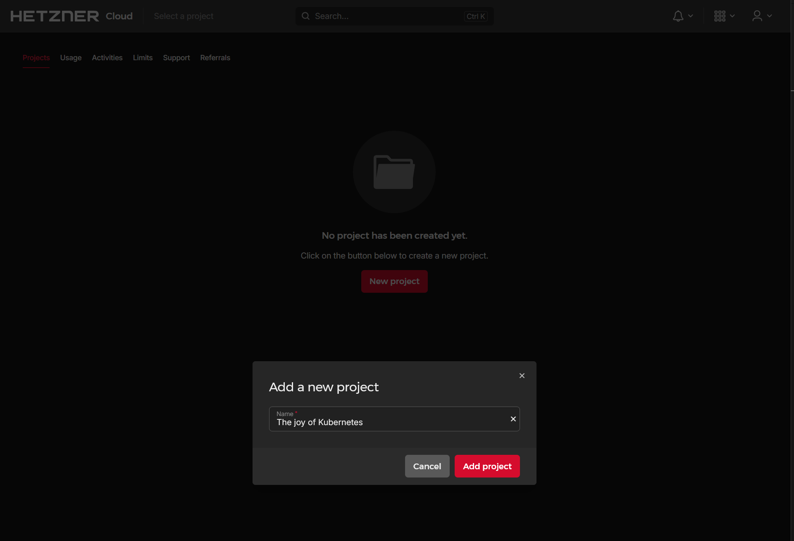
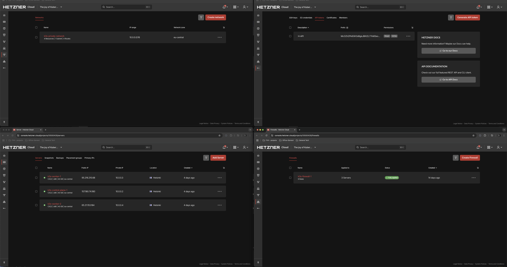
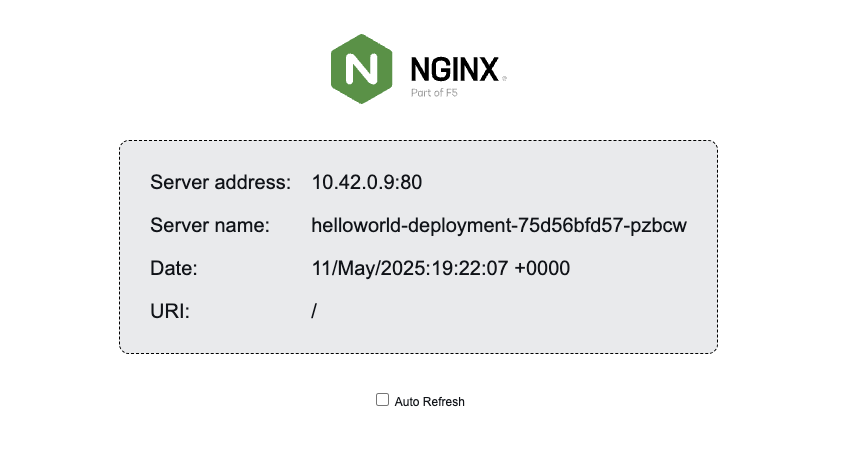

# The joy of Kubernetes

A working repository for Haaga-Helia Cloud Services (ICT4HM101-3007) course project work.

## Project plan

The plan is to set up a Kubernetes cluster using k3s on Hetzner Cloud, deploy test applications.

**Note** Since this was our first time deploying a Kubernetes cluster, we had to redo the cluster creation several times to reach the outcome detailed in this report. Major problems that occurred are noted and detailed in this document but done so in a way that they fit the narrative of this report.

## Setting up Hetzner Cloud

## *Prerequisites*

1. **Hetzner Cloud Account:** You need an active account 
2. **Local Tools:** `kubectl` (the Kubernetes command-line tool) and `helm` (package manager for Kubernetes) installed on your local machine.

### 1. Creating a new project

We started off by creating a new could project. I Hetzner this is quite straightforward.

#### 1.1 Enable connectivity

1. **SSH Key**
    * Add the needed public SSH keys to the Hetzner project (Security \-\> SSH Keys). 
2. **API Token**
    * Generate an API token within the Hetzner Cloud project (Security \-\> API Tokens). Grant it **Read & Write** permissions. Store this token securely.  

### 2. Setting up infrastructure for the new project

**We used Hetzner Cloud Console for setting up our infrastructure**  

1. **Create 3 Cloud Servers (1 control-plane, 2 workers)**
    * **Location:** Helsinki (hel1)  
    * **ISO Image:** Ubuntu 24.04  
    * **Type:** CX22 (Intel, 2 vCPU:s, 4 GB RAM, 40 GB SSD, 20 TB Traffic)  
    * **SSH Key:** Public key from project members computer  
    * **Naming:** k3s-control-plane-1, k3s-worker-1, k3s-worker-2
2. **Create Private Network:**
  * **Name:** k3s-private-network
  * **IP range:** 10.0.0.0/16
  * Attach all 3 servers.
    * **Note**, the servers have now an IP on a public and a private network, on two different interfaces.
3. **Create Firewall:** 
  * **Name:** k3s-firewall-1
  * **Inbound Rules:** 
    * Allow:
      * SSH (TCP/22 from your All IPV4 (Restrict to my IP in the future)) 
      * K8s API (TCP/6443 from your All IPV4 (Restrict to my IP in the future)) 
      * NodePorts (TCP/30000-32767 from All IPV4)
      * K3s internal ports (UDP/8472, TCP/10250 from private network IPs)
      * ICMP (from private network IPs).  
    * **Outbound Rules:** 
      * Allow all.  
    * Apply to all 3 servers.

### 3 Kubernetes deployment

Now that we have are infrastructure setup, we can start installing Kubernetes and deploying the cluster.

before we did anything, we updated the virtual machines.

* use ssh to connect to the machines.
* Note, since this is a bare machine, the only user accessible is ``root``.  
* Update packages ``apt-get update``
* Upgrade packages ``apt-get upgrade``

Once this was done, we could begin the K3S installation.

#### 3.1.1 Install Kubernetes control plane

Install K3s in the k3s-control-plane-1 machine.
In this case we use the [install_K3s_server](scripts/K3s/install_K3s_server.sh) script.
The easiest way was just to copy ``scp`` the shell script from the local machine to the virtual machine and make it and executable ``chmod -x``. 
Once this is done, we just executed (``./install_K3s_server.sh``)the script and check the installation was performed without error.

#### 3.1.2 Get the K3s token

Once the installation is done, we need the k3s token from the control-plane for the worker node installation.  
``cat /var/lib/rancher/k3s/server/node-token``
We copied this to be used in the worker node installation.

#### 3.2 Install Kubernetes Worker nodes

Install K3s in the worker-node machines (k3s-worker-1 & k3s-worker-2).
We are using the same script base as with the K3s server installation but with a few modifications, primarily we define the control-plane IP-address and K3S token. All of this is explained in the [agent installation script](Scripts/K3s/install_K3s_worker.sh).
Like with the previous installation, the easiest way was just to copy ``scp`` the shell script from the local machine to the virtual machine and make it and executable ``chmod -x``.
Once this is done, we just executed (``./install_K3s_worker.sh``)the script and check the installation was performed without error.

### 3.3 Get the Kubernetes configuration for local management

Once the worker nodes are installed, we need to get the control-plane configuration, so we can manage to kubernetes network from a local computer (in our case using ``kubectl``).

we copied the ks3.yaml configuration file (located at ``/etc/rancher/k3s/k3s.yaml``) from the k8s-control-plane-1 machine to our local computer. In the file, we edit the ``server``address (which is local host (127.0.0.1) by default) with the IP of the  k3s-control-plane-1 machine.

Once done, we refer [this .yaml file](Kubernetes_configuration_files/k3s.yaml) as the Kubernetes configuration for ``kubectl``.
After this, we can check if we can connect to the Kubernetes cluster.

### 3.4 Integrate Hetzner cloud features

No that we have confirmed that our cluster base is up a running, let's integrate Hetzner cloud features that we can utilize Cloud Controller Manager (CCM) and Container Storage Interface (CSI).

**Note** We originally planned on using the CSI to manage volumes, but in the end our deployments could run without them, so CSI functionality was not used in this project.

#### Cloud Controller Manager (CCM)

The Cloud Controller Manager (CCM) acts as a bridge between a Kubernetes cluster and the specific API's of the cloud provider where the Kubernetes cluster is hosted (In our case Hetzner but this also could be AWS or Azure).
The CCM enables managing of cloud provider specific features that interact with the Kubernetes cluster.
These are for example:

* Configuring network routes.
* Managing load balancers

#### Container Storage Interface (CSI)

The Container Storage Interface (CSI) is an API that cloud providers develop, which allow their storage systems to work with container orchestrators, like Kubernetes. It simplifies how containerized applications access and use persistent storage.

Installing the CCM and CSI can be done in four (4) steps. You can do it in only three (3), but in my opinion the fourth step is the most important.

  1. Create a secret that stores the Hetzner API key and network name (the networks numerical ID can also be used)
  2. Install Hetzner CCM
  3. Install CSI
  4. Confirm installation

#### 3.4.1 Create a secret that stores the Hetzner API key

We used the API token we generated earlier, but we also needed the name of the private network (k3s-private-network) that the Kubernetes cluster id located.

One thing to note is we also need to specify a namespace that the secret is associated to, we used the namespace `kube-system`, since it is the recommended namespace for system components.

##### Kubernetes namespaces

In Kubernetes, namespaces provide a mechanism for isolating groups of resources within a single cluster. By default, Kubernetes has four (4) initial namespaces in use:

1. default
2. kube-node-lease
3. kube-public
4. kube-system

The secret can be created straight from the command line, or creating a .yaml file and using that as a reference on the commandline. We chose the later, because this .yaml file could be included as a reference on the projects repository.

We created the file and named it [hcloud-secret.yaml](Tokens_and_Secrets/hcloud-secret.yaml). We chose the name `hcloud` for the secret, this will be referred to later in the installation.

To create the secret, we used `kubectl` to generate it.

`kubectl apply -f hcloud-secret.yaml`

#### 3.4.2 Installing CCM and CSI

Once we have the secret created, we could start installing the CCM ans CSI in to the `kube-system` namespace. We used `helm charts` for this.

##### Helm charts

Helm charts are a collection files that describe a Kubernetes cluster's resources and package them together as an application. Essentially these are installation files for a Kubernetes application, that are located in a Helm repository. Helm can be used to manage and deploy these charts.

Before we could start the installation, we needed to add the helm repo containing them. Hetzner hosts it't own repo (https://charts.hetzner.cloud), so we added that. Once added, we updated the helm repos in use.

At this point we already knew what charts we needed, but this can be checked by using the command `helm search repo hetzner`

[Hetzner helm charts](Pictures/Helm/Hetzner%20helm%20charts.png)

The charts we needed were "hcloud-csi" and "hcloud-cloud-controller-manager".

We made a [shell script](Scripts/CMM&CSI/install_hetzner_cmm&csi.sh) that runs the needed commands. **Note** the script also checks that the services are running.

#### Problems with K3s build in Traefik services when using Hetzner CCM

During our our project we encountered a problem when using the K3S build in Traefik service with the Hetzner CCM. Until the pod deployment everything seemed to be in order, but once we deployed our pods and the associated services, automatic network routing did not happen between the load balancer and the deployments in the private network.

This problem took a while to resolve and we ended up redeploying the whole cluster twice (at least), but in the end we found that by setting up the K3S without the build in Traefik (flaggs `--disable=traefik`and  `--disable=servicelb` in the install_K3s_server.sh script) and by manually installing the Traefik services we could get it to work.

As before, we created an [installation script](Scripts/Traefik/install_traefik.sh) for this.  
Once the installation script was done, we waited for a moment for the Hetzner CCM to pick it up and checked if the service running by using the commands:

* `kubectl get pods -n traefik -l app.kubernetes.io/name=traefik` for status
* `kubectl get svc -n traefik traefik` to check if the  Hetzner CCM to provision the LoadBalancer and for Hetzner to assign IP's to it

Since we were a bit skeptical at this point, we also used the `kubectl logs -n traefik -l app.kubernetes.io/name=traefik` command to check for possible errors.

Once we were certain (or at least hopeful) that everything should be ready for application deployment, we started by deploying a simple web application.

### 3 Kubernetes application deployment

In our projects scope, we are mainly interested in four(4) aspects of Kubernetes for deploying applications, these are:

* Pods
* Deployments
* Services
* IngressRoute

#### Pods

Pods represent the smallest deployable unit in Kubernetes. They represent a single instance (application) of one or more containers, a single pod and the containers within it share the same resources and are always associated to the same worker node.

#### Deployments

A deployment is used to manage and scale pods. Deployments declare the desired state of the pod (pods if there are replicas), this often include how many replicas of the pod are to be deployed. Deployments also ease updating and the lifecycle management of deployed pods.

#### Services

Services provide an abstraction layer for the deployments, providing a stable network end point and loadbalancing for them.

#### IngressRoute

IngressRoute provide more advanced ways to manage external HTTP/S access to services within a Kubernetes cluster. In it's simplest form, it can map host names and paths to the deployment.

#### 3.1 First application deployment

In our deployment we used all of these elements to deploy out first application. We selected a simple nginx hello application as a pod, defined the desired state and replicas in the deployment, mapped the internal IP access to the service for the load balancer with a service and defined the hostname mapping with the IngressRoute.

We defined these in separate .yaml files and executed them in an order using `kubectl apply -f file.yaml`.  **Note** That since the pods are defined in the deployment, we do not need to specify them in a separately.
The execution order was:

1. [helloworld-deployment.yaml](Pod_configurations/hello_world/helloworld-deployment.yaml)
    * Verify with `kubectl get pods -n helloworld -l app=helloworld`
2. [helloworld-service.yaml](Pod_configurations/hello_world/helloworld-service.yaml)
    * Verify with `kubectl get svc -n helloworld helloworld-service`
3. [helloworld-ingressroute.yaml](Pod_configurations/hello_world/helloworld-ingressroute.yaml)
    * Verify with `kubectl get ingressroute -n helloworld helloworld-ingressroute`

Once we were sure that the application was running, we could check it pointing a browser to http://hello-world-k3s.erkinjuntti.eu. 

#### Traefik with SSL/TLS encryption

Now at this point we were providing the application with out encryption (HTTP). Albeit it was a static page without any sensitive information, web browsers typically don't like unencrypted web sites and for this reason we decided to try an implement SSL/TLS encryption on it using Let's encrypt. Luckily Traefik offers guide an examples for this, and since we already had made a DNS entry for the application, we just needed to upgrade the previously installed Traefik service and modify the helloworld-ingressroute.yaml file. We made a separate [script for the Traefik upgrade](Scripts/Traefik/traefik_upgrade_https.sh)).

Once the upgrade and ingressroute file modification was completed, we could access the application using HTTP (port 443).

#### 3.2 Second application deployment

### Hetzner Kubernetes schematic

*Note, the schematic is done using [mermaid](https://mermaid.js.org/)*

[Hetzner Kubernetes schematic](Architecture/schematic.md)
